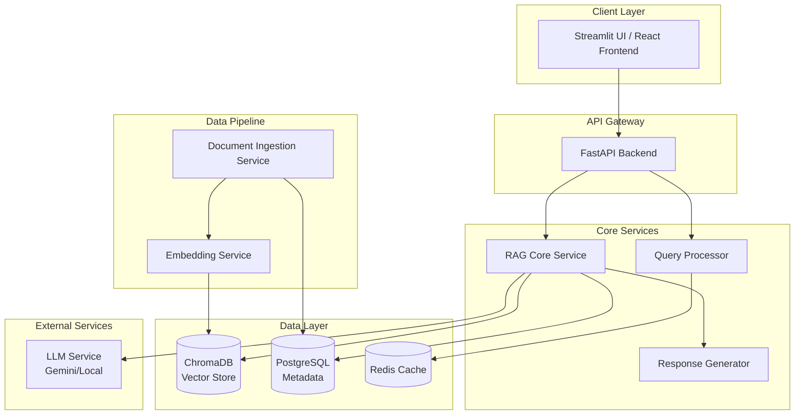

# معماری سیستم دستیار هوشمند حقوقی

# System Architecture - Legal AI Assistant

## 1. نمای کلی و سبک معماری

### Overview & Architectural Style

این سیستم بر اساس معماری سرویس‌گرا (Service-Oriented Architecture) با رابط کاربری مجزا طراحی شده است. معماری کلی از الگوی Microservices الهام گرفته و برای مقیاس‌پذیری و نگهداری آسان بهینه شده است.

### نمودار معماری سطح بالا

